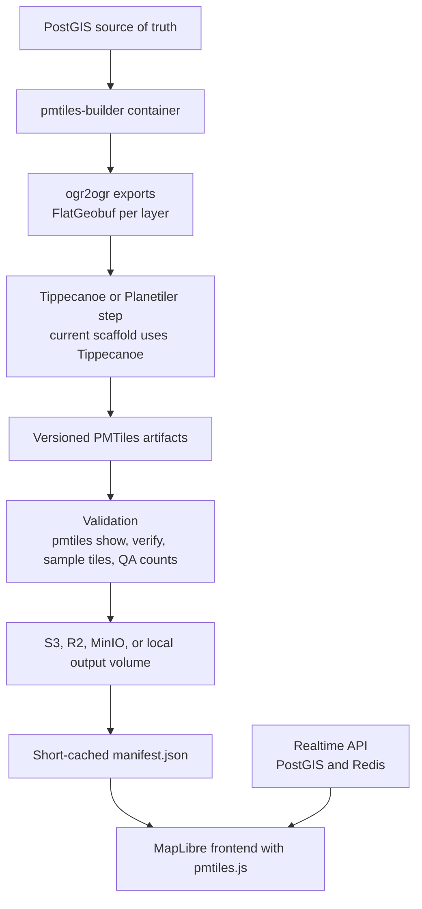

# Docker PMTiles Pipeline

This repository is a Dockerized PMTiles generation pipeline for PostGIS-backed map data. It treats PMTiles as immutable generated snapshots, not as a realtime database.

## Architecture



PMTiles files are immutable archives. A feature update in PostGIS can affect many z/x/y tiles across multiple zoom levels, and changing those tiles can require rewriting archive directories. There is no simple, production-grade "update one feature in place" PMTiles workflow. The practical pattern is scheduled rebuilds plus partitioning by zoom range, region, and layer group.

Frequent PostGIS writes do not require frequent PMTiles rebuilds. PostGIS remains the live system of record, while PMTiles are controlled releases of map data. Data that changes minute by minute should be served from an API overlay backed by PostGIS or Redis.

## Why Split The Tilesets

Use separate PMTiles for:

- `global-z0-z5-{timestamp}.pmtiles`: small overview only. Countries, water, boundaries, major cities, and major roads. Keep it small because every map session often needs low zooms first.
- `basemap-{region}-z6-z14-{timestamp}.pmtiles`: detailed regional basemap. Roads, buildings, water, landuse, and boundaries.
- `pois-{region}-z10-z16-{timestamp}.pmtiles`: regional stable POIs. Restaurants, shops, landmarks, names, categories, addresses.

Regional files prevent rebuilding the whole world when Iraq, UAE, or Saudi data changes. Layer-group files prevent rebuilding buildings and roads just because POI metadata changed. Keep highly dynamic facts out of PMTiles: live drivers, `open_now`, availability, offers, active orders, and temporary status belong in API responses.

## Folder Layout

```text
pmtiles-pipeline/
├── docker-compose.yml
├── Dockerfile
├── .env.example
├── requirements.txt
├── config/
│   ├── regions.json
│   ├── layers.json
│   └── schedules.json
├── scripts/
│   ├── build.py
│   ├── export_layers.py
│   ├── generate_pmtiles.py
│   ├── validate_pmtiles.py
│   ├── publish_manifest.py
│   ├── upload.py
│   ├── prune.py
│   └── common.py
├── output/
├── tmp/
├── logs/
└── README.md
```

## Docker Services

`pmtiles-builder` contains GDAL/ogr2ogr, Tippecanoe, the PMTiles CLI, PostgreSQL client tools, and Python orchestration scripts.

Optional services:

- `scheduler`: runs the Python scheduler against `config/schedules.json`.
- `minio`: local S3-compatible object storage testing.
- `static`: Nginx static server for local PMTiles and manifest testing.

No Martin or live tile server is required. PMTiles should be served as static files with HTTP range request support.

## Local Development

```bash
cp .env.example .env
docker compose build pmtiles-builder
docker compose --profile static up -d static
```

Run one local build without uploading:

```bash
docker compose run --rm pmtiles-builder python3 scripts/build.py --target global --region global --skip-upload --no-prune
docker compose run --rm pmtiles-builder python3 scripts/build.py --target basemap --region ${REGION:-saudi} --skip-upload --no-prune
docker compose run --rm pmtiles-builder python3 scripts/build.py --target pois --region ${REGION:-saudi} --skip-upload --no-prune
```

Generated files land under:

```text
output/tiles/global/
output/tiles/iraq/
output/manifests/
```

For local static testing, use URLs like:

```text
http://localhost:8088/tiles/global/global-z0-z5-20260529-0000.pmtiles
http://localhost:8088/manifests/iraq.json
```

From Windows/the host, validate the local static service with `localhost:8088`:

```bash
python scripts/validate_published.py --static-base-url http://localhost:8088 --region iraq --strict-cache
python scripts/smoke_static.py --base-url http://localhost:8088 --region iraq --strict-cache --style-api-base-url http://localhost:8090
```

Do not use `http://localhost:8088` for `--verify-url` inside `docker compose run pmtiles-builder`; inside that container, `localhost` is the builder container. For Docker-internal verification, start the static service and use the Compose service DNS name:

```bash
docker compose --profile static up -d static
docker compose run --rm \
  -e S3_PUBLIC_BASE_URL=http://static:80 \
  -e CDN_BASE_URL=http://static:80 \
  pmtiles-builder python3 scripts/build.py --target basemap --region iraq --skip-upload --verify-url --no-prune
```

## MapLibre API

Run the local API that turns the active manifest into a MapLibre style:

```bash
docker compose --profile static up -d static map-api
```

Useful URLs:

```text
http://localhost:8090/docs
http://localhost:8090/api/docs
http://localhost:8090/api/openapi.json
http://localhost:8090/api/health
http://localhost:8090/api/regions
http://localhost:8090/api/styles
http://localhost:8090/api/manifest.json
http://localhost:8090/api/style.json
http://localhost:8090/api/manifest/saudi.json
http://localhost:8090/api/style/saudi.json
http://localhost:8090/api/style.json?lon=50.6&lat=26.2
http://localhost:8090/api/style.json?style=dark
http://localhost:8090/demo
```

Swagger UI is available at `http://localhost:8090/docs`. The API is intentionally small: it reads the active manifest and style files, then returns MapLibre-ready JSON. It does not rebuild data, mutate PMTiles, or serve realtime tiles.

MapLibre needs the PMTiles protocol registered in the browser:

```js
const protocol = new pmtiles.Protocol();
maplibregl.addProtocol("pmtiles", protocol.tile);

const map = new maplibregl.Map({
  container: "map",
  style: "http://localhost:8090/api/style.json"
});
```

The API does not serve live tiles and does not mutate PMTiles. It only reads the short-cached manifest and returns a style pointing at the immutable PMTiles files. MapLibre still asks for z/x/y tiles internally, but the PMTiles browser protocol turns those tile requests into HTTP range reads against the `.pmtiles` file.

### Style Files

Complete MapLibre style files live in:

```text
config/styles/
```

Current styles:

```text
light.json
dark.json
navigation.json
```

Each style file controls the map appearance: colors, road widths, layer order, labels, POI circles, min/max zoom visibility, and text paint. The API injects only the active PMTiles sources from the manifest. Style files should reference these source ids:

```text
global
basemap
pois
```

And these source-layer names from the current pipeline:

```text
roads
buildings
water
landuse
boundaries
places
pois
```

Create a new style from an existing one:

```bash
docker compose run --rm pmtiles-builder python3 scripts/create_style.py --from-style light --id taxi-night --name "Taxi Night"
docker compose restart map-api
```

Then edit `config/styles/taxi-night.json` and load it with:

```text
http://localhost:8090/api/style.json?style=taxi-night
```

Labels require both data and style support. The data must include name fields in PMTiles, the style must include `symbol` layers, and the style must define a `glyphs` URL. `GLYPHS_URL` is the URL template emitted in style JSON:

```text
GLYPHS_URL=https://glyphs.example.com/fonts/{fontstack}/{range}.pbf
```

Production must set `GLYPHS_URL` explicitly. Do not use `https://demotiles.maplibre.org/font/{fontstack}/{range}.pbf` in production; readiness fails when `ENVIRONMENT=production` and the demo URL is configured or `GLYPHS_URL` is missing. Development may leave `GLYPHS_URL` empty to use the demo URL with a warning.

Local glyph hosting is also supported:

```text
GLYPHS_URL=/api/fonts/{fontstack}/{range}.pbf
LOCAL_GLYPHS_URL=/api/fonts/{fontstack}/{range}.pbf
GLYPHS_DIR=/app/config/glyphs
GLYPH_FONTSTACKS=Noto Sans Regular
```

Install local PBFs under:

```text
config/glyphs/Noto Sans Regular/0-255.pbf
config/glyphs/Noto Sans Regular/1024-1279.pbf
config/glyphs/Noto Sans Regular/1536-1791.pbf
```

Readiness validates at least:

```text
0-255       Latin basic
1024-1279   Cyrillic for Russian
1536-1791   Arabic script for Arabic, Kurdish, Persian, and Urdu
```

Recommended production strategy: host generated glyph PBFs on the same CDN as PMTiles and set `GLYPHS_URL` to that CDN template. Use the local `/api/fonts/{fontstack}/{range}.pbf` route for staging or small deployments only when the PBF files are installed in `config/glyphs`.

Glyph smoke checks:

```bash
curl.exe -i "http://localhost:8090/api/health/ready"
curl.exe -i "http://localhost:8090/api/fonts/Noto%20Sans%20Regular/0-255.pbf"
curl.exe -i "http://localhost:8090/api/fonts/Noto%20Sans%20Regular/1024-1279.pbf"
curl.exe -i "http://localhost:8090/api/fonts/Noto%20Sans%20Regular/1536-1791.pbf"
```

### Multilingual Labels

Phase 1 multilingual labels use OSM tags only. There is no realtime translation, no machine translation, and no Wikidata enrichment in this phase. Wikidata label fallback is planned for a later offline enrichment phase.

Supported label languages:

```text
ar en ku fa tr fr de es ru pt it ur
```

Explicitly unsupported for now:

```text
hi zh ja
```

When `lang` is omitted, styles preserve the existing label behavior and read the default `name` field. When `lang` is supplied, `/api/style.json` and `/api/style/{region}.json` rewrite symbol `text-field` expressions to use language-specific fallbacks.

Examples:

```text
http://localhost:8090/api/style/iraq.json?style=light&lang=en
http://localhost:8090/api/style/iraq.json?style=light&lang=ar
http://localhost:8090/api/style/iraq.json?style=light&lang=ku
http://localhost:8090/api/style.json?region=iraq&style=light&lang=en
```

The PMTiles must be rebuilt before multilingual labels appear in map features. The build pipeline exports:

```text
name name_local name_ar name_en name_ku name_fa name_tr name_fr name_de name_es name_ru name_pt name_it name_ur name_int
```

The exporter detects source availability at build time. If the osm2pgsql database has explicit multilingual columns, hstore `tags`, or json/jsonb `tags`, it extracts the OSM tags from there. If preserved tags are unavailable, language fields are exported as `NULL` and the existing `name` behavior remains unchanged. Kurdish uses `name:ku` first, then `name:ckb` as an OSM-tag fallback.

Roads only export `name_ar`, `name_en`, and `name_ku` in Phase 1 to limit PMTiles size growth. Places, POIs, admin labels, major cities, and countries export the full supported language set.

Glyph readiness is required for production. Arabic, Kurdish, Persian, Urdu, Russian, and Latin labels need hosted glyph PBFs with sufficient Unicode coverage.

Only enable object storage publishing after local PMTiles open correctly in MapLibre.

### Production API Hardening

The recommended production serving model is:

```text
CDN/static/object storage serves immutable PMTiles
map-api serves manifest/style/OpenAPI/health endpoints
direct vector/raster tile API endpoints stay disabled unless explicitly approved
```

Environment mode:

```text
APP_ENV=development|staging|production
```

`ENVIRONMENT` is still accepted as a backward-compatible alias when `APP_ENV` is not set. The default is `development`. Production readiness enforces safe configuration; development keeps local work easy and reports warnings.

Production API requirements:

```text
APP_ENV=production
API_CORS_ORIGIN=https://maps.example.com,https://app.example.com
MAP_INTERNAL_TOKEN=<at least 32 random characters>
PUBLIC_DIRECT_TILE_ENDPOINTS=false
REQUIRE_REVERSE_PROXY=true
TRUSTED_PROXY_MODE=standard
PUBLIC_API_BASE_URL=https://maps-api.example.com
```

In production:

- `MAP_INTERNAL_TOKEN` must be set, must not be `dev-internal-token`, and must be at least 32 characters.
- `API_CORS_ORIGIN` must be an explicit allowlist; `*` is rejected.
- `REGION` must be configured and `output/manifests/<REGION>.json` must exist.
- Manifest references must point to existing versioned immutable `.pmtiles` files.
- Matching `.validation.json` files must exist and contain `ok: true`.
- `REQUIRE_REVERSE_PROXY=true` is required after configuring the reverse proxy/CDN.

Direct tile API policy:

```text
PUBLIC_DIRECT_TILE_ENDPOINTS=true|false
```

Defaults:

```text
development=true
staging=false
production=false
```

When disabled, public `/api/vector/...` and `/api/raster/...` tile payload endpoints return `403`; internal-token diagnostics may still access them. Public TileJSON remains available, but it does not advertise blocked direct API tile URLs. Use PMTiles URLs from manifests/styles for public maps.

If direct tile APIs are intentionally exposed in production, set:

```text
PUBLIC_DIRECT_TILE_ENDPOINTS=true
ALLOW_PUBLIC_DIRECT_TILES_IN_PRODUCTION=true
REQUIRE_REVERSE_PROXY=true
```

Readiness will warn that reverse proxy/CDN rate limiting is required. Do not expose direct tile APIs publicly without edge rate limiting and cache protection.

Style validation request bodies are capped by:

```text
STYLE_VALIDATE_MAX_BODY_BYTES=1048576
```

Oversized `/api/styles/validate` requests return `413 payload_too_large`.

Production readiness check:

```bash
curl.exe -sS "http://localhost:8090/api/health/ready" | python -m json.tool
```

The readiness body includes `environment`, `production_config_ready`, `cors_safe`, `internal_token_safe`, `default_region_ready`, `direct_tile_policy`, `gateway_deployment`, `gateway_contract_documented`, `glyphs_ready`, `manifest_ready`, `warnings`, and `failures`. Secret values are never included.

### Test Profiles

The API test suite is split by runtime intent:

- Development integration tests assume `APP_ENV=development`, `PUBLIC_DIRECT_TILE_ENDPOINTS=true`, the dev internal token is allowed, and direct vector/raster tile endpoints are public.
- Production policy tests assert hardening behavior with `APP_ENV=production`, `PUBLIC_DIRECT_TILE_ENDPOINTS=false`, public style/manifest access, blocked public direct tiles, and token-gated internal routes.
- Smoke tests are environment-aware and check public health/docs/style/manifest/static PMTiles plus the direct tile status expected by the active policy.

Development integration tests:

```bash
$env:APP_ENV="development"
$env:PUBLIC_DIRECT_TILE_ENDPOINTS="true"
$env:MAP_INTERNAL_TOKEN="dev-internal-token"
$env:MAP_API_TEST_PROFILE="development"
docker compose up -d --force-recreate map-api
python -m unittest tests.test_api_integration
```

Production policy tests:

```bash
python -m unittest tests.test_production_hardening tests.test_glyph_readiness tests.test_observability tests.test_smoke_profiles
```

If the live API is running in locked-down production mode, `tests.test_api_integration` skips cleanly because it is explicitly a development-profile integration suite.

### Smoke Checks

API smoke:

```bash
python scripts/smoke_api.py --base-url http://localhost:8090 --region iraq --style light --lang en --profile auto
```

Production smoke with readiness required:

```bash
python scripts/smoke_api.py --base-url http://localhost:8090 --region iraq --style light --lang en --profile production --require-ready
```

Static PMTiles smoke:

```bash
python scripts/smoke_static.py --base-url http://localhost:8088 --region iraq
```

Basic load smoke:

```bash
python scripts/load_smoke.py --base-url http://localhost:8090 --region iraq --style light --lang en --requests 20 --concurrency 4
```

The load smoke targets the style and manifest endpoints by default. It adds the direct tile endpoint only when the API policy says direct public tiles are enabled, unless `--include-direct` or `--no-direct` is supplied.

### Runtime Metrics

The API exposes low-cardinality runtime metrics:

```bash
curl.exe -sS "http://localhost:8090/api/metrics" | python -m json.tool
curl.exe -sS "http://localhost:8090/api/metrics?format=prometheus"
```

Metrics include:

- `total_requests`
- `requests_by_status`
- `requests_by_route_group`
- `error_count`
- `latency_ms.p50`, `latency_ms.p95`, `latency_ms.p99`
- cache `hits`, `misses`, and `hit_rate`
- `direct_tile_requests_total`
- `direct_tile_blocked_total`
- `style_requests_total`
- `manifest_requests_total`
- `raster_requests_total`
- `vector_requests_total`
- `uptime_seconds`

Before public launch, watch p95/p99 latency, 4xx/5xx rate, direct tile blocked count, cache hit rate, and CDN/static PMTiles range failures. Request logs are structured JSON and include request ID, method, redacted path, route group, status, duration, environment, direct-tile-blocked flag, and user agent.

## Object Storage

For local MinIO:

```bash
docker compose --profile local-object-storage up -d minio
```

Create the bucket named by `S3_BUCKET` in the MinIO console, or point the same environment variables at R2/S3 in production.

Object storage variables:

```text
S3_BUCKET=pmtiles
S3_ENDPOINT_URL=http://minio:9000
S3_REGION=auto
S3_ACCESS_KEY_ID=minioadmin
S3_SECRET_ACCESS_KEY=minioadmin
S3_FORCE_PATH_STYLE=true
S3_PUBLIC_BASE_URL=http://localhost:8088
CDN_BASE_URL=http://localhost:8088
VERIFY_PUBLISHED_URL=false
```

`S3_PUBLIC_BASE_URL` or `CDN_BASE_URL` is the public URL prefix written into manifests and styles. In production this should be the CDN URL, for example `https://tiles.example.com`. For R2/S3, leave `S3_ENDPOINT_URL` empty when using the provider default endpoint; set it for R2-compatible or MinIO endpoints. Use `S3_FORCE_PATH_STYLE=true` for MinIO and for providers that require path-style addressing.

Local URL rules:

- From Windows/the host, use `http://localhost:8088`.
- From `docker compose run pmtiles-builder --verify-url`, use `http://static:80`.
- If `S3_PUBLIC_BASE_URL` is set, it takes precedence over `CDN_BASE_URL`; override both in Docker-internal verification commands.

Validate publishing config before a production build:

```bash
python scripts/upload.py --check-config
```

PMTiles are uploaded with:

```text
Cache-Control: public, max-age=31536000, immutable
Content-Type: application/vnd.pmtiles
```

Manifests are uploaded with:

```text
Cache-Control: public, max-age=60, must-revalidate
Content-Type: application/json; charset=utf-8
```

Published PMTiles must support HTTP range requests. A CDN/static check should return `200` or `206`, and a range request such as `Range: bytes=0-1023` should return a non-empty body with sane `Content-Length` and, for `206`, `Content-Range`.

Validate the published/static surface:

```bash
python scripts/validate_published.py --static-base-url http://localhost:8088 --region iraq --strict-cache
python scripts/smoke_static.py --base-url http://localhost:8088 --region iraq --strict-cache --style-api-base-url http://localhost:8090
```

Local Docker-internal build verification:

```bash
docker compose --profile static up -d static
docker compose run --rm \
  -e S3_PUBLIC_BASE_URL=http://static:80 \
  -e CDN_BASE_URL=http://static:80 \
  pmtiles-builder python3 scripts/build.py --target global --region global --skip-upload --verify-url --no-prune
docker compose run --rm \
  -e S3_PUBLIC_BASE_URL=http://static:80 \
  -e CDN_BASE_URL=http://static:80 \
  pmtiles-builder python3 scripts/build.py --target basemap --region iraq --skip-upload --verify-url --no-prune
docker compose run --rm \
  -e S3_PUBLIC_BASE_URL=http://static:80 \
  -e CDN_BASE_URL=http://static:80 \
  pmtiles-builder python3 scripts/build.py --target pois --region iraq --skip-upload --verify-url --no-prune
```

For a production CDN:

```bash
python scripts/validate_published.py \
  --manifest-url https://tiles.example.com/manifests/iraq.json \
  --style-url https://maps-api.example.com/api/style/iraq.json?style=light\&lang=en \
  --public-base-url https://tiles.example.com \
  --strict-cache
```

Safe production release flow:

1. Build a new immutable PMTiles artifact.
2. Validate the local PMTiles file and write `.validation.json`.
3. Upload the PMTiles artifact when `S3_BUCKET` is configured.
4. If `VERIFY_PUBLISHED_URL=true` or `--verify-url` is used, validate CDN/static range access before publishing a manifest.
5. Publish the manifest only after the PMTiles file exists, validation JSON has `ok: true`, upload succeeded when enabled, and optional CDN/static validation passed.
6. Smoke the manifest, PMTiles range requests, and style PMTiles URLs.
7. Prune only after a successful release.

If manifest upload fails, the old local active manifest remains unchanged.

## Build Strategy

Each build does this:

1. Acquire PostgreSQL advisory lock from `BUILD_LOCK_ID`.
2. Export selected layers from PostGIS using bbox-filtered SQL.
3. Run data quality checks per layer.
4. Generate a versioned PMTiles file with Tippecanoe.
5. Validate the PMTiles archive locally.
6. Upload the versioned PMTiles artifact if `S3_BUCKET` is configured.
7. Optionally verify the CDN/static URL with a range request.
8. Publish the manifest only after validation succeeds.
9. Prune old PMTiles versions, never deleting active manifest references.

Failure behavior:

- Export failure aborts.
- Generation failure aborts.
- Validation failure aborts.
- Upload failure aborts.
- CDN/static validation failure aborts when `--verify-url` or `VERIFY_PUBLISHED_URL=true` is used.
- Manifest publish failure leaves the old manifest active.
- Pruning failure is only a warning.

## Versioned Files

The default naming strategy is:

```text
global-z0-z5-{timestamp}.pmtiles
basemap-{region}-z6-z14-{timestamp}.pmtiles
pois-{region}-z10-z16-{timestamp}.pmtiles
```

Never overwrite these files. Rollback is done by changing the manifest to point at an older file. Keep production versions for 14 to 30 days and never prune files referenced by active manifests.

## Manifest Strategy

Manifests are short-cached and reference the active immutable PMTiles versions. The frontend reads the manifest first, then opens the PMTiles URLs from it.

Example:

```json
{
  "schema_version": 1,
  "region": "iraq",
  "last_updated": "2026-05-29T12:00:00Z",
  "tilesets": {
    "global": {
      "url": "https://cdn.example.com/tiles/global/global-z0-z5-20260529-0000.pmtiles",
      "minzoom": 0,
      "maxzoom": 5
    },
    "basemap": {
      "url": "https://cdn.example.com/tiles/iraq/basemap-iraq-z6-z14-20260529-0200.pmtiles",
      "minzoom": 6,
      "maxzoom": 14
    },
    "pois": {
      "url": "https://cdn.example.com/tiles/iraq/pois-iraq-z10-z16-20260529-1200.pmtiles",
      "minzoom": 10,
      "maxzoom": 16
    }
  }
}
```

Refresh a regional manifest after independent global, basemap, and POI rebuilds:

```bash
docker compose run --rm pmtiles-builder python3 scripts/refresh_manifest.py --region iraq --skip-upload --no-prune
```

The refresh command selects the latest local artifact for `global`, regional `basemap`, and regional `pois` only when the PMTiles file exists and its matching `.validation.json` has `ok: true`. It writes a new short-cached regional manifest that points at versioned immutable PMTiles files, and it does not delete old artifacts.

Rollback is manifest-only and never deletes PMTiles:

```bash
python scripts/rollback_manifest.py --region iraq --list
python scripts/rollback_manifest.py --region iraq --dry-run
python scripts/rollback_manifest.py --region iraq --apply --skip-upload
```

Explicit rollback to chosen versions is also supported:

```bash
python scripts/rollback_manifest.py --region iraq --dry-run \
  --global-filename global-z0-z5-20260529-2005.pmtiles \
  --basemap-filename basemap-iraq-z6-z14-20260529-2153.pmtiles \
  --pois-filename pois-iraq-z10-z16-20260529-2028.pmtiles
```

Pruning keeps active manifest references, keeps files inside the retention window, and skips PMTiles files without a known versioned filename:

```bash
python scripts/prune.py --retention-days 30
```

## Schedules

Recommended starting cadence:

- Global low zoom: daily or weekly.
- Regional basemap: daily or every 12 to 24 hours.
- Regional POIs: every 1 to 6 hours.
- Dynamic API overlay: realtime, outside PMTiles.

Use the scheduler profile:

```bash
docker compose --profile scheduler up -d scheduler
```

Current update behavior:

1. PostGIS can keep changing independently.
2. PMTiles only change when `pmtiles-builder` runs manually or the optional scheduler runs a due job from `config/schedules.json`.
3. A successful build exports from PostGIS, generates a new versioned PMTiles file, validates it, and publishes the manifest.
4. The frontend/API read the latest manifest. If a build fails, the old manifest stays active and the map keeps using the previous PMTiles.

For production, an external cron, CI job, Kubernetes CronJob, or Airflow task is often cleaner than long-running cron inside the container. The included scheduler is intentionally simple and reads `config/schedules.json`.

## Validation Checklist

The scaffold validates:

- File exists.
- File is non-empty.
- `pmtiles show` works.
- `pmtiles verify` works.
- Expected layers exist in metadata.
- Minzoom and maxzoom match config.
- Sample tiles are readable:
  - global: z0, z3, z5
  - basemap: z6, z10, z14
  - POIs: z10, z14, z16
- Optional CDN/static server returns 200 or 206 for a range request.
- Feature counts are checked when min/max thresholds are added to `layers.json`.
- No critical null geometries.
- No critical invalid geometries.

Data quality metrics written during export:

- `feature_count_by_layer`
- `null_geometry_count`
- `invalid_geometry_count`
- `empty_name_count` for POIs
- `missing_category_count` for POIs
- `geometry_type_check`
- `bbox_extent`

## Handling Frequent PostGIS Updates

For MVP, rebuild the whole selected regional/layer file on a schedule. Do not rebuild PMTiles on every DB update.

Future optimizations:

- Track dirty regions.
- Track dirty layer groups.
- Rebuild only affected region/layer files.
- Keep POIs separate from basemap.
- Move highly dynamic data to API endpoints.

This is usually enough to avoid world-scale rebuilds without pretending PMTiles is a mutable database.

## Security

- Keep PostGIS private.
- Do not commit `.env`.
- Use a least-privilege DB user that can read only required tables or views.
- Use least-privilege S3/R2 credentials.
- Do not log secrets.
- Expose public read access only through CDN/static hosting.

## Monitoring

Track these metrics:

- `last_build_success_timestamp`
- `build_duration_seconds`
- `build_failure_count`
- `pmtiles_file_size_bytes`
- `feature_count_by_layer`
- `validation_failure_count`
- `active_manifest_version`
- CDN 404/5xx rate
- Frontend tile load errors

The build writes JSON artifacts under `tmp/{build_id}/` and logs under `logs/`.

## Phase 1 Single-Server Production Deployment

Phase 1 does not require R2, S3, or an external CDN. The production layout is:

- `https://api.tavrix.com/maps`: public Gateway routes for authentication, authorization, rate limits, customer identity, and any usage/billing policy.
- `http://tavrixmaptiles-map-api:8090`: internal `map-api` on the Docker/private network only.
- `https://tiles.tavrix.com`: public Nginx static server for immutable PMTiles, glyph PBFs, sprites, and short-cached manifests.

Public direct `/api/vector/...` and `/api/raster/...` endpoints remain disabled in production. Public maps should load PMTiles through URLs returned by style/manifest JSON, then the browser PMTiles protocol performs HTTP range requests against `https://tiles.tavrix.com`.

Production environment example:

```env
APP_ENV=production
TILES_BEHIND_GATEWAY=true
PUBLIC_DIRECT_TILE_ENDPOINTS=false
PUBLIC_API_BASE_URL=https://api.tavrix.com/maps
CDN_BASE_URL=https://tiles.tavrix.com
S3_PUBLIC_BASE_URL=https://tiles.tavrix.com
STATIC_BASE_URL=https://tiles.tavrix.com
GLYPHS_URL=https://tiles.tavrix.com/fonts/{fontstack}/{range}.pbf
SPRITES_BASE_URL=https://tiles.tavrix.com/sprites
MAP_INTERNAL_TOKEN=replace-with-at-least-32-random-characters
API_CORS_ORIGIN=https://api.tavrix.com,https://app.tavrix.com
REQUIRE_REVERSE_PROXY=true
TRUSTED_PROXY_MODE=standard
STATIC_PUBLISH_ROOT=/var/www/tavrix-tiles
```

The production Nginx config is [nginx/tavrix-tiles.conf](C:/TavrixMap/TavrixMapTiles/nginx/tavrix-tiles.conf). It serves:

```text
/tiles/      Cache-Control: public, max-age=31536000, immutable
/fonts/      Cache-Control: public, max-age=31536000, immutable
/sprites/    Cache-Control: public, max-age=31536000, immutable
/manifests/  Cache-Control: public, max-age=60, must-revalidate
```

PMTiles are served as `application/vnd.pmtiles`, with gzip disabled and byte ranges enabled. Manifests are short-cached because rollback is manifest-only.

Server/static sync:

```powershell
python .\scripts\publish_static_local.py --root /var/www/tavrix-tiles --dry-run
python .\scripts\publish_static_local.py --root /var/www/tavrix-tiles
```

The script copies:

```text
output/tiles/*      -> /var/www/tavrix-tiles/tiles/
output/manifests/*  -> /var/www/tavrix-tiles/manifests/
config/glyphs/*     -> /var/www/tavrix-tiles/fonts/
config/sprites/*    -> /var/www/tavrix-tiles/sprites/
```

It refuses to overwrite an existing `.pmtiles` file with different bytes. Publish a new versioned PMTiles filename instead.

Gateway public route contract:

```text
GET /maps/style.json
GET /maps/style/{region}.json
GET /maps/manifest.json
GET /maps/manifest/{region}.json
GET /maps/regions
GET /maps/styles
```

Internal/admin Gateway routes:

```text
POST /internal/maps/cache/clear
POST /internal/maps/cache/warm
GET /internal/maps/metrics
GET /internal/maps/tiles/inspect/{region}/{z}/{x}/{y}
```

Never expose `map-api`, `/api/vector/...`, `/api/raster/...`, `/api/cache/...`, `/api/tiles/inspect/...`, or `/api/metrics` publicly. `/api/metrics` is secret-free but should be restricted to the private network or an IP allowlist.

Tiles does not own customer identity, API keys, billing tables, usage events, rollups, plans, pricing, or invoices. The Gateway owns those concerns. Tiles only documents the routes the Gateway will usually consider when defining map usage policy.

The Gateway may choose to count one successful authenticated style request as one `map_load`:

```text
GET /maps/style.json
GET /maps/style/{region}.json
```

That is a Gateway policy, not Tiles state. Tiles does not count, store, or price usage. Static Nginx requests are monitored for infrastructure cost, fair-use review, and abuse investigation only. The integration contract is in [docs/gateway-integration-contract.md](C:/TavrixMap/TavrixMapTiles/docs/gateway-integration-contract.md).

Single-server verification:

```powershell
curl.exe -sS http://localhost:8090/api/health/ready | python -m json.tool
curl.exe -sS http://localhost:8090/api/metrics | python -m json.tool

python .\scripts\validate_published.py `
  --static-base-url https://tiles.tavrix.com `
  --region iraq `
  --style-url https://api.tavrix.com/maps/style/iraq.json?style=light^&lang=en `
  --public-base-url https://tiles.tavrix.com `
  --strict-cache

python .\scripts\smoke_static.py `
  --base-url https://tiles.tavrix.com `
  --region iraq `
  --strict-cache

python .\scripts\smoke_single_server_production.py `
  --gateway-base-url https://api.tavrix.com/maps `
  --tiles-base-url https://tiles.tavrix.com `
  --internal-map-api http://localhost:8090 `
  --valid-token <public-api-token> `
  --invalid-token invalid-token `
  --region iraq `
  --style light
```

To verify Gateway-owned usage policy, run the single-server smoke with an optional Gateway usage-counter test hook:

```powershell
python .\scripts\smoke_single_server_production.py `
  --gateway-base-url https://api.tavrix.com/maps `
  --tiles-base-url https://tiles.tavrix.com `
  --internal-map-api http://localhost:8090 `
  --valid-token <public-api-token> `
  --invalid-token invalid-token `
  --usage-url https://api.tavrix.com/internal/maps/test-usage `
  --region iraq `
  --style light
```

Infrastructure cost monitoring from the Nginx JSON log:

```powershell
python .\scripts\estimate_static_cost.py `
  --log C:\nginx\logs\tavrix-tiles.access.log `
  --provider-profile vps `
  --days-sampled 1
```

Move to R2/CDN when monthly static bandwidth is above roughly 5 TB, peak static traffic is above roughly 500 requests/sec, users far from the VPS report latency, Nginx static p95 is too high, or the server is approaching disk/network saturation.

## Final Recommendation

Start with Docker local builds. Build `global-z0-z5` plus one region. Use Iraq once your PostGIS import contains Iraq data; this local scaffold is currently set to `saudi` because that is the region covered by the connected `osm_db`. For an MVP, build only roads, water, and POIs first. Add buildings, landuse, boundaries, and labels after the first stable publishing loop works.

Do not start with world-detailed PMTiles. Do not cluster POIs by default. Do not add aggressive PostGIS simplification at MVP stage. Keep PMTiles scheduled and immutable, and use the API for realtime data.

## References

- PMTiles CLI: https://docs.protomaps.com/pmtiles/cli
- PMTiles MapLibre usage: https://docs.protomaps.com/pmtiles/maplibre
- Tippecanoe PMTiles output and layer options: https://github.com/felt/tippecanoe
"# TavrixMapTiles" 
