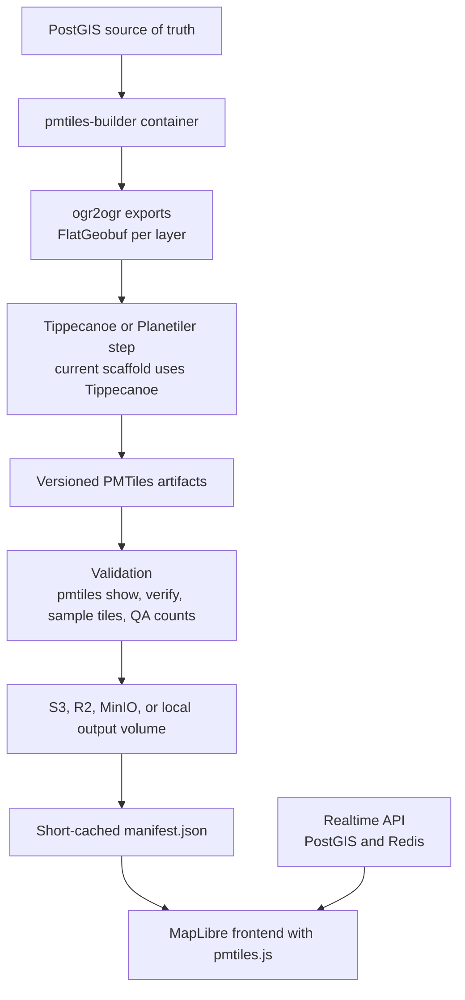

# Docker PMTiles Pipeline

This repository is a Dockerized PMTiles generation pipeline for PostGIS-backed map data. It treats PMTiles as immutable generated snapshots, not as a realtime database.

## Architecture



PMTiles files are immutable archives. A feature update in PostGIS can affect many z/x/y tiles across multiple zoom levels, and changing those tiles can require rewriting archive directories. There is no simple, production-grade "update one feature in place" PMTiles workflow. The practical pattern is scheduled rebuilds plus partitioning by zoom range, region, and layer group.

Frequent PostGIS writes do not require frequent PMTiles rebuilds. PostGIS remains the live system of record, while PMTiles are controlled releases of map data. Data that changes minute by minute should be served from an API overlay backed by PostGIS or Redis.

## Why Split The Tilesets

Use separate PMTiles for:

- `global-z0-z5-{timestamp}.pmtiles`: small overview only. Countries, water, boundaries, major cities, and major roads. Keep it small because every map session often needs low zooms first.
- `basemap-{region}-z6-z14-{timestamp}.pmtiles`: detailed regional basemap. Roads, buildings, water, landuse, and boundaries.
- `pois-{region}-z10-z16-{timestamp}.pmtiles`: regional stable POIs. Restaurants, shops, landmarks, names, categories, addresses.

Regional files prevent rebuilding the whole world when Iraq, UAE, or Saudi data changes. Layer-group files prevent rebuilding buildings and roads just because POI metadata changed. Keep highly dynamic facts out of PMTiles: live drivers, `open_now`, availability, offers, active orders, and temporary status belong in API responses.

## Folder Layout

```text
pmtiles-pipeline/
├── docker-compose.yml
├── Dockerfile
├── .env.example
├── requirements.txt
├── config/
│   ├── regions.json
│   ├── layers.json
│   └── schedules.json
├── scripts/
│   ├── build.py
│   ├── export_layers.py
│   ├── generate_pmtiles.py
│   ├── validate_pmtiles.py
│   ├── publish_manifest.py
│   ├── upload.py
│   ├── prune.py
│   └── common.py
├── output/
├── tmp/
├── logs/
└── README.md
```

## Docker Services

`pmtiles-builder` contains GDAL/ogr2ogr, Tippecanoe, the PMTiles CLI, PostgreSQL client tools, and Python orchestration scripts.

Optional services:

- `scheduler`: runs the Python scheduler against `config/schedules.json`.
- `minio`: local S3-compatible object storage testing.
- `static`: Nginx static server for local PMTiles and manifest testing.

No Martin or live tile server is required. PMTiles should be served as static files with HTTP range request support.

## Local Development

```bash
cp .env.example .env
docker compose build pmtiles-builder
docker compose --profile static up -d static
```

Run one local build without uploading:

```bash
docker compose run --rm pmtiles-builder python3 scripts/build.py --target global --region global --skip-upload --no-prune
docker compose run --rm pmtiles-builder python3 scripts/build.py --target basemap --region ${REGION:-saudi} --skip-upload --no-prune
docker compose run --rm pmtiles-builder python3 scripts/build.py --target pois --region ${REGION:-saudi} --skip-upload --no-prune
```

Generated files land under:

```text
output/tiles/global/
output/tiles/iraq/
output/manifests/
```

For local static testing, use URLs like:

```text
http://localhost:8088/tiles/global/global-z0-z5-20260529-0000.pmtiles
http://localhost:8088/manifests/iraq.json
```

## MapLibre API

Run the local API that turns the active manifest into a MapLibre style:

```bash
docker compose --profile static up -d static map-api
```

Useful URLs:

```text
http://localhost:8090/docs
http://localhost:8090/api/docs
http://localhost:8090/api/openapi.json
http://localhost:8090/api/health
http://localhost:8090/api/regions
http://localhost:8090/api/styles
http://localhost:8090/api/manifest.json
http://localhost:8090/api/style.json
http://localhost:8090/api/manifest/saudi.json
http://localhost:8090/api/style/saudi.json
http://localhost:8090/api/style.json?lon=50.6&lat=26.2
http://localhost:8090/api/style.json?style=dark
http://localhost:8090/demo
```

Swagger UI is available at `http://localhost:8090/docs`. The API is intentionally small: it reads the active manifest and style files, then returns MapLibre-ready JSON. It does not rebuild data, mutate PMTiles, or serve realtime tiles.

MapLibre needs the PMTiles protocol registered in the browser:

```js
const protocol = new pmtiles.Protocol();
maplibregl.addProtocol("pmtiles", protocol.tile);

const map = new maplibregl.Map({
  container: "map",
  style: "http://localhost:8090/api/style.json"
});
```

The API does not serve live tiles and does not mutate PMTiles. It only reads the short-cached manifest and returns a style pointing at the immutable PMTiles files. MapLibre still asks for z/x/y tiles internally, but the PMTiles browser protocol turns those tile requests into HTTP range reads against the `.pmtiles` file.

### Style Files

Complete MapLibre style files live in:

```text
config/styles/
```

Current styles:

```text
light.json
dark.json
navigation.json
```

Each style file controls the map appearance: colors, road widths, layer order, labels, POI circles, min/max zoom visibility, and text paint. The API injects only the active PMTiles sources from the manifest. Style files should reference these source ids:

```text
global
basemap
pois
```

And these source-layer names from the current pipeline:

```text
roads
buildings
water
landuse
boundaries
places
pois
```

Create a new style from an existing one:

```bash
docker compose run --rm pmtiles-builder python3 scripts/create_style.py --from-style light --id taxi-night --name "Taxi Night"
docker compose restart map-api
```

Then edit `config/styles/taxi-night.json` and load it with:

```text
http://localhost:8090/api/style.json?style=taxi-night
```

Labels require both data and style support. The data must include name fields in PMTiles, the style must include `symbol` layers, and the style must define a `glyphs` URL. For local dev this project uses:

```text
https://demotiles.maplibre.org/font/{fontstack}/{range}.pbf
```

For production, host your own glyphs and set `GLYPHS_URL`.

Only enable object storage publishing after local PMTiles open correctly in MapLibre.

## Object Storage

For local MinIO:

```bash
docker compose --profile local-object-storage up -d minio
```

Create the bucket named by `S3_BUCKET` in the MinIO console, or point the same environment variables at R2/S3 in production. PMTiles are uploaded with:

```text
Cache-Control: public, max-age=31536000, immutable
```

Manifests are uploaded with:

```text
Cache-Control: public, max-age=60, must-revalidate
```

## Build Strategy

Each build does this:

1. Acquire PostgreSQL advisory lock from `BUILD_LOCK_ID`.
2. Export selected layers from PostGIS using bbox-filtered SQL.
3. Run data quality checks per layer.
4. Generate a versioned PMTiles file with Tippecanoe.
5. Validate the PMTiles archive locally.
6. Upload the versioned PMTiles artifact if `S3_BUCKET` is configured.
7. Optionally verify the CDN/static URL with a range request.
8. Publish the manifest only after validation succeeds.
9. Prune old PMTiles versions, never deleting active manifest references.

Failure behavior:

- Export failure aborts.
- Generation failure aborts.
- Validation failure aborts.
- Upload failure aborts.
- CDN/static validation failure aborts when `--verify-url` or `VERIFY_PUBLISHED_URL=true` is used.
- Manifest publish failure leaves the old manifest active.
- Pruning failure is only a warning.

## Versioned Files

The default naming strategy is:

```text
global-z0-z5-{timestamp}.pmtiles
basemap-{region}-z6-z14-{timestamp}.pmtiles
pois-{region}-z10-z16-{timestamp}.pmtiles
```

Never overwrite these files. Rollback is done by changing the manifest to point at an older file. Keep production versions for 14 to 30 days and never prune files referenced by active manifests.

## Manifest Strategy

Manifests are short-cached and reference the active immutable PMTiles versions. The frontend reads the manifest first, then opens the PMTiles URLs from it.

Example:

```json
{
  "schema_version": 1,
  "region": "iraq",
  "last_updated": "2026-05-29T12:00:00Z",
  "tilesets": {
    "global": {
      "url": "https://cdn.example.com/tiles/global/global-z0-z5-20260529-0000.pmtiles",
      "minzoom": 0,
      "maxzoom": 5
    },
    "basemap": {
      "url": "https://cdn.example.com/tiles/iraq/basemap-iraq-z6-z14-20260529-0200.pmtiles",
      "minzoom": 6,
      "maxzoom": 14
    },
    "pois": {
      "url": "https://cdn.example.com/tiles/iraq/pois-iraq-z10-z16-20260529-1200.pmtiles",
      "minzoom": 10,
      "maxzoom": 16
    }
  }
}
```

## Schedules

Recommended starting cadence:

- Global low zoom: daily or weekly.
- Regional basemap: daily or every 12 to 24 hours.
- Regional POIs: every 1 to 6 hours.
- Dynamic API overlay: realtime, outside PMTiles.

Use the scheduler profile:

```bash
docker compose --profile scheduler up -d scheduler
```

Current update behavior:

1. PostGIS can keep changing independently.
2. PMTiles only change when `pmtiles-builder` runs manually or the optional scheduler runs a due job from `config/schedules.json`.
3. A successful build exports from PostGIS, generates a new versioned PMTiles file, validates it, and publishes the manifest.
4. The frontend/API read the latest manifest. If a build fails, the old manifest stays active and the map keeps using the previous PMTiles.

For production, an external cron, CI job, Kubernetes CronJob, or Airflow task is often cleaner than long-running cron inside the container. The included scheduler is intentionally simple and reads `config/schedules.json`.

## Validation Checklist

The scaffold validates:

- File exists.
- File is non-empty.
- `pmtiles show` works.
- `pmtiles verify` works.
- Expected layers exist in metadata.
- Minzoom and maxzoom match config.
- Sample tiles are readable:
  - global: z0, z3, z5
  - basemap: z6, z10, z14
  - POIs: z10, z14, z16
- Optional CDN/static server returns 200 or 206 for a range request.
- Feature counts are checked when min/max thresholds are added to `layers.json`.
- No critical null geometries.
- No critical invalid geometries.

Data quality metrics written during export:

- `feature_count_by_layer`
- `null_geometry_count`
- `invalid_geometry_count`
- `empty_name_count` for POIs
- `missing_category_count` for POIs
- `geometry_type_check`
- `bbox_extent`

## Handling Frequent PostGIS Updates

For MVP, rebuild the whole selected regional/layer file on a schedule. Do not rebuild PMTiles on every DB update.

Future optimizations:

- Track dirty regions.
- Track dirty layer groups.
- Rebuild only affected region/layer files.
- Keep POIs separate from basemap.
- Move highly dynamic data to API endpoints.

This is usually enough to avoid world-scale rebuilds without pretending PMTiles is a mutable database.

## Security

- Keep PostGIS private.
- Do not commit `.env`.
- Use a least-privilege DB user that can read only required tables or views.
- Use least-privilege S3/R2 credentials.
- Do not log secrets.
- Expose public read access only through CDN/static hosting.

## Monitoring

Track these metrics:

- `last_build_success_timestamp`
- `build_duration_seconds`
- `build_failure_count`
- `pmtiles_file_size_bytes`
- `feature_count_by_layer`
- `validation_failure_count`
- `active_manifest_version`
- CDN 404/5xx rate
- Frontend tile load errors

The build writes JSON artifacts under `tmp/{build_id}/` and logs under `logs/`.

## Final Recommendation

Start with Docker local builds. Build `global-z0-z5` plus one region. Use Iraq once your PostGIS import contains Iraq data; this local scaffold is currently set to `saudi` because that is the region covered by the connected `osm_db`. For an MVP, build only roads, water, and POIs first. Add buildings, landuse, boundaries, and labels after the first stable publishing loop works.

Do not start with world-detailed PMTiles. Do not cluster POIs by default. Do not add aggressive PostGIS simplification at MVP stage. Keep PMTiles scheduled and immutable, and use the API for realtime data.

## References

- PMTiles CLI: https://docs.protomaps.com/pmtiles/cli
- PMTiles MapLibre usage: https://docs.protomaps.com/pmtiles/maplibre
- Tippecanoe PMTiles output and layer options: https://github.com/felt/tippecanoe
"# TavrixMapTiles" 
